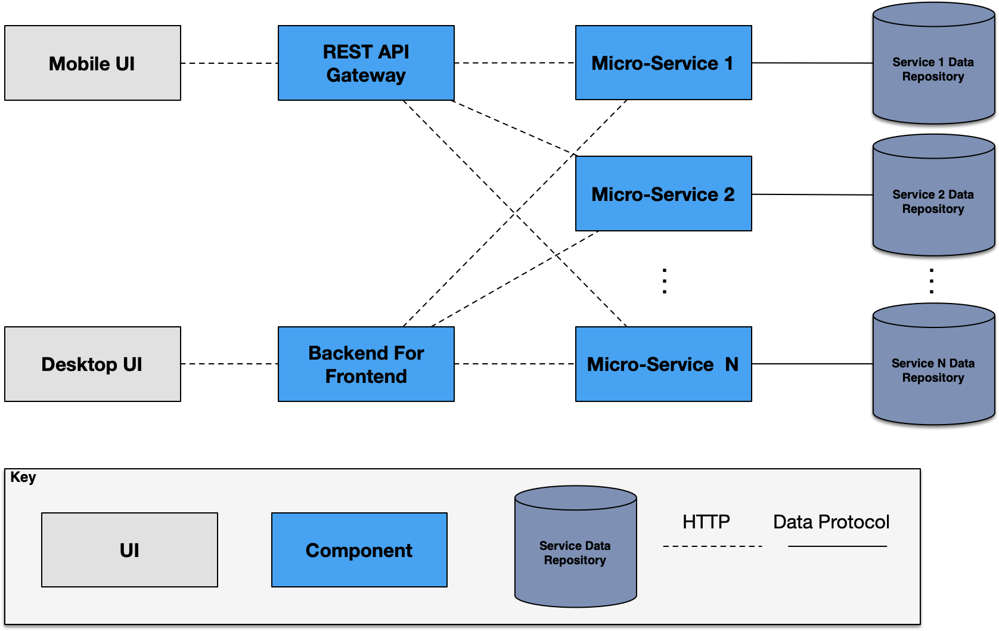
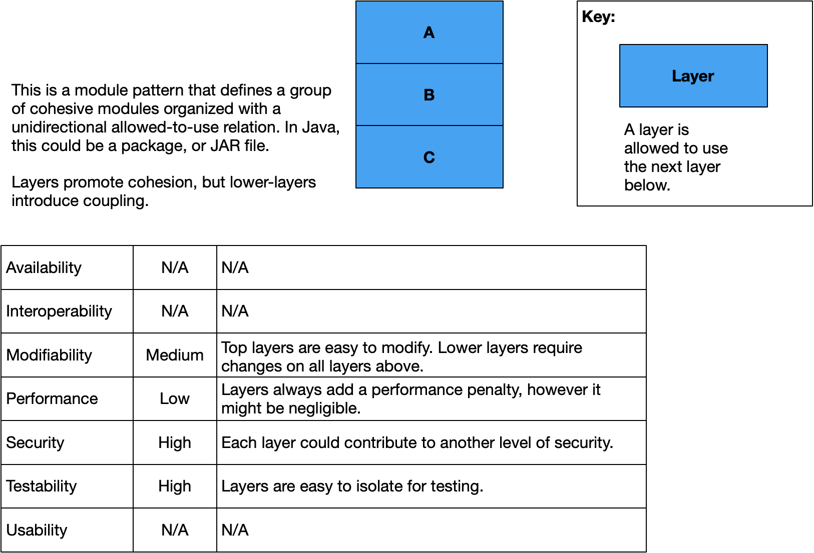
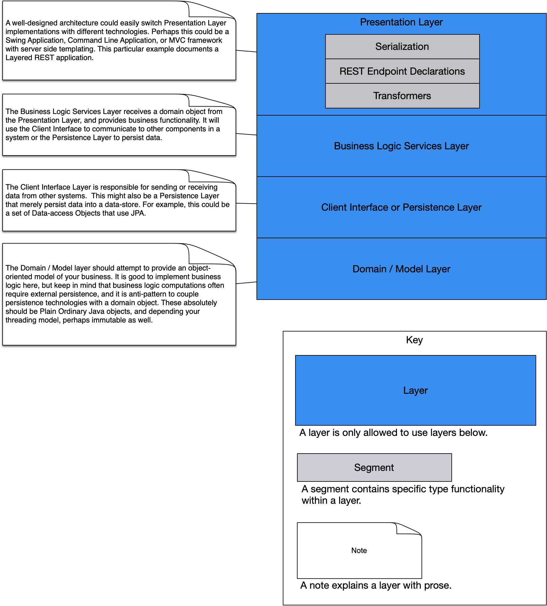
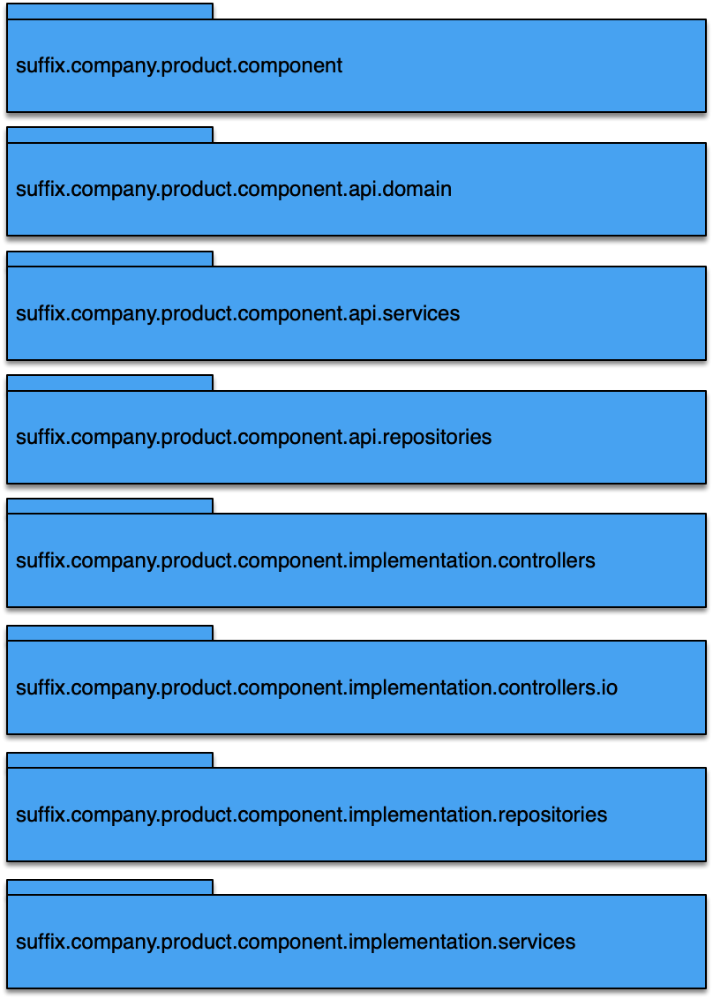
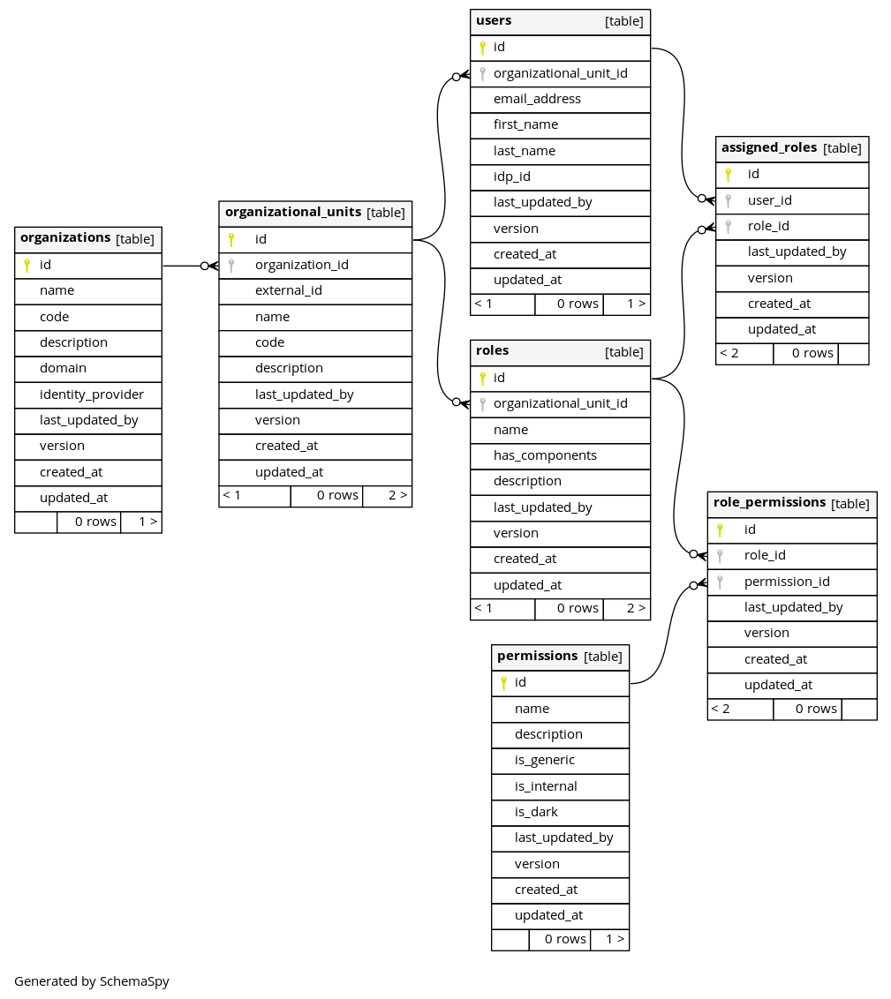

# Quick Start

Run the `configure.sh` command.

Example:

```text
/configure.sh                                                                                                                                 INT ✘ 
First we are going to derive the root package structure for this java project.
Remember to use valid package names in the following prompts.
Please use abbreviations where appropriate because package names are code.
Please enter the company's common name. This will be used for the docker company label [Company]:Acme, Inc.
Please enter the company domain suffix in lowercase [suffix]: com
Please enter the company domain name without the suffix in lowercase [company]: acme
Please enter the abbreviated or short product name in lowercase [product]: weapons
Please enter the abbreviated or short component name in lowercase [component]: pu136mod
The root package name will be: [com.acme.weapons.pu136mod] do you accept [y/n]?: y 
pruning empty directories.
fixing packages.
fixing imports.
fixing build.gradle
fixing settings.gradle
fixing src/main/resources/application.yaml
fixing docker-compose.yaml
fixing src/main/docker-compose/envs/pu136mod.env
fixing src/main/docker-compose/envs/db.env
fixing src/main/docker-compose/schemaspy/schemaspy.properties
fixing run.sh
fixing Dockerfile
```

Then commit your changes.

```bash
docker-compose up
```

Don't like your results?

```bash
docker-compose down -v
git reset --hard
```

Then repeat until you like the results.

```bash
git add -A
git commit -m "Configured reference architecture."
```


## Local Execution

```bash
docker-compose up
docker-compose stop component.product.company.suffix
```

Copy this into your IDE environment variables
`SPRING_DATASOURCE_URL=jdbc:postgresql://postgresql.db.component.product.company.suffix:5432/component;SPRING_LIQUIBASE_ENABLED=false;`

# Features

This project unapologetically provides a standard microservices reference architecture.
It is built on yet another opinionated framework, Spring Boot. 

The main difference between this and plain ordinary Spring Boot is that this promotes
architectural patterns that simply work.

1. Pre-defined Java Package structure recommendation that follows the Layered-Architecture Pattern.
2. Gradle build with Maven style Dependency Management built-in.
3. A Docker build.
4. A starter database schema with auditing built-in.
5. Liquibase Migrations.
6. An agile Schema Diagram creator.
7. Scaffolding to run this system in Docker Compose.
8. Swagger enabled, but can be disabled with environment variable.

All package names are documented, and explained in the architecture of this document.

## Migration Script

This project includes a migration script to convert the names and packages
to one of your liking.

Just run the `./configure.sh` command.  

## Preconfigured Docker and Docker Compose

This project includes scaffolding and containerization.

It includes a pre-built Dockerfile.

Docker Compose will build your project (`docker-compose build`), in addition,
it will run a PostgreSQL database, execute your liquibase migrations,
and publish your schema into an NGINX server so that your team can have discussions about the schema.

Just type `docker-compose up`

## URLs

[View Schema](http://localhost:8090)

[View Actuator](http://localhost:8080)
[Swagger UI](http://localhost:8080/swagger-ui/index.html)

## Database Conventions Bootstrap

1. Configures a PostgreSQL database.
2. Schema supports auditing.
3. Schema supports multi-tenancy.
4. Schema is managed by Liquibase.
5. Shema published by Schema Spy.

## Kibana Logging
To enable Kibana logging just activate the Kibana profile through the SPRING_PROFILES_ACTIVE environment variable.
```
SPRING_PROFILES_ACTIVE=kibana
```

# Architecture
This project functions as a reference architecture for microservices.

## Design Concepts

### Reference Architectures

A survey of reference architectures used in this design iteration.

None.

### Architecture Patterns

A survey of known architecture patterns used in this design iteration.

### Microservices Architecture Pattern

A microservices architecture consists of a collection of small, autonomous services. Each service is self-contained and
should implement a single business capability within a bounded context. A bounded context is a natural division within 
a business and provides an explicit boundary within which a domain model exists.

A very important principle in Microservices architecture are loose coupling and high cohesion.
It is called “micro” because it meant to be cohesive with respect to a limited set of functionality.

It is loosely coupled in the sense that a micro-service typically is the owner of an unshared database.
This allows the micro service to own changes on a database without impacting other applications,
and it also allows for a service to scale independently on as needed basis.

* Microservices are small, independent, and loosely coupled. A single small team of developers can write and maintain 
a service.
* Each service is a separate codebase, which can be managed by a small development team.
* Services can be deployed independently. A team can update an existing service without rebuilding and redeploying 
the entire application.
* Services are responsible for persisting their own data or external state. This differs from the traditional model, 
where a separate data layer handles data persistence.
* Services communicate with each other by using well-defined APIs. Internal implementation details of each service 
are hidden from other services.
* Supports polyglot programming. For example, services don't need to share the same technology stack, libraries, 
or frameworks.



### Layered Architecture Pattern

The actual Micro-Service component is typically built using a layered architecture.

Len Bass, Paul Clements, and Rick Kazman best explain the Layered Architecture as, “The Layered Architecture Pattern 
defines layers as a grouping of modules or services and a unidirectional allowed-to-use relation among layers. 
Layers must have a strict-ordering relation, in which a layer can only use public interfaces of a layer below,” 
in the book Software Architecture in Practice1.

The benefit of the layered-architecture is that it allows for a separation of concerns, allows for a division of 
labor, and it is typically easy to refactor a top layer.

Its drawback is that there is a performance cost for each layer, and it can be very expensive to refactor lower layers.



## Design Decisions
| Id      | Design Decisions and Location                                                                                                                                                    | Rationale                                                                                                                                                                                                                                                                                                                                                                                                                                                             |
|---------|----------------------------------------------------------------------------------------------------------------------------------------------------------------------------------|-----------------------------------------------------------------------------------------------------------------------------------------------------------------------------------------------------------------------------------------------------------------------------------------------------------------------------------------------------------------------------------------------------------------------------------------------------------------------|
| DD-1.1  | This component will use JDK 17.                                                                                                                                                  | JDK 17 has long term support. <table><thead><tr><th>Alternative</th><th>Reason for Discarding</th></tr></thead><tbody><tr><td>JDK 11</td><td>JDK 17 is already over a year old.</td></tr><tr><td>JDK 8</td><td>No long term support.</td></tr><tr><td>Other JDKs</td><td>No long term support.</td></tr><tr><td>Other languages</td><td>We would like to standardize on Java as much as possible.</td></tr></tbody></table>                                           |
| DD-1.2  | This component will be built with Gradle groovy DLS.                                                                                                                             | Gradle builds more quickly than Maven <table><thead><tr><th>Alternative</th><th>Reason for Discarding</th></tr></thead><tbody><tr><td>Maven</td><td>It builds more slowly than Maven.</td></tr></tbody></table>                                                                                                                                                                                                                                                       |
| DD-1.3  | This component will use the latest stable version of Spring Boot.                                                                                                                | Spring Boot is a very popular framework for building Microservices. <table><thead><tr><th>Alternative</th><th>Reason for Discarding</th></tr></thead><tbody><tr><td>None</td><td>Spring Boot is very popular.</td></tr></tbody></table>                                                                                                                                                                                                                               |
| DD-1.4  | This component will use Spring Web.                                                                                                                                              | Integrates more easily with Spring Boot and Spring Security. <table><thead><tr><th>Alternative</th><th>Reason for Discarding</th></tr></thead><tbody><tr><td>JAX-RS</td><td>JAX-RS indeed has a nicer API, but Spring Web is functionally similar, and integrates better with all the other Spring libraries.</td></tr></tbody></table>                                                                                                                               |
| DD-1.5  | This component will use Checkstyle plugin.                                                                                                                                       | Enforcement of a consistent style promotes conceptual integrity. <table><thead><tr><th>Alternative</th><th>Reason for Discarding</th></tr></thead><tbody><tr><td>No checkstyle.</td><td>Lacks conceptual integrity.</td></tr></tbody></table>                                                                                                                                                                                                                         |
| DD-1.6  | Checkstyle coding conventions will follow Sun Coding Conventions and most IntelliJ defaults. Curly braces required after if, do, while, else, or for statement. No star imports. | Enforcement of a consistent style promotes conceptual integrity. <table><thead><tr><th>Alternative</th><th>Reason for Discarding</th></tr></thead><tbody><tr><td>Inconsistent style</td><td>Lacks conceptual integrity.</td></tr></tbody></table>                                                                                                                                                                                                                     |
| DD-1.7  | This component will use the Lombok plugin for domain objects, configuration objects, transfer objects, and entity objects.                                                       | Automatically creates getters, setters, constructors, hashcode, toString, thus this eliminates boiler-plate code, and promotes conceptual integrity. <table><thead><tr><th>Alternative</th><th>Reason for Discarding</th></tr></thead><tbody><tr><td>No Lombok</td><td>This creates a lot of boiler-plate code.</td></tr></tbody></table>                                                                                                                             |
| DD-1.8  | This component will use the Liquibase plugin.                                                                                                                                    | Liquibase is an open-source database schema change management solution which enables you to manage revisions of your database changes easily. <table><thead><tr><th>Alternative</th><th>Reason for Discarding</th></tr></thead><tbody><tr><td>Flyway</td><td>Not as feature rich as Liquibase.</td></tr><tr><td>No schema management</td><td>This leads to chaos in managing a database.</td></tr></tbody></table>                                                    |
| DD-1.9  | This component will use Schema Spy to automatically publish its database schema.                                                                                                 | Documentation will facilitate communication with the team. <table><thead><tr><th>Alternative</th><th>Reason for Discarding</th></tr></thead><tbody><tr><td>No database documentation</td><td>Less documentation.</td></tr></tbody></table>                                                                                                                                                                                                                            |
| DD-1.10 | This component will have a predefined schema that supports multi-tenancy, security, and auditing.                                                                                | Provides a reasonable example for creating a schema.<table><thead><tr><th>Alternative</th><th>Reason for Discarding</th></tr></thead><tbody><tr><td>None</td><td>N/A</td></tr></tbody></table>                                                                                                                                                                                                                                                                        |
| DD-1.11 | This database schema will follow a specified set of database conventions.                                                                                                        | These conventions will make it easier to support different frameworks such as JPA or Ruby on Rails. This promotes conceptual integrity. <table><thead><tr><th>Alternative</th><th>Reason for Discarding</th></tr></thead><tbody><tr><td>None</td><td>N/A</td></tr></tbody></table>                                                                                                                                                                                    |
| DD-1.12 | This component will follow a specified set of REST API conventions.                                                                                                              | These conventions make the API easier to understand. This promote conceptual integrity.<table><thead><tr><th>Alternative</th><th>Reason for Discarding</th></tr></thead><tbody><tr><td>No convention.</td><td>The API will become chaotic and unintuitive.</td></tr></tbody></table>                                                                                                                                                                                  |
| DD-1.13 | The REST API will use swagger for documentation.                                                                                                                                 | Documentation will facilitate communication with the team.<table><thead><tr><th>Alternative</th><th>Reason for Discarding</th></tr></thead><tbody><tr><td>No API documentation</td><td>Less communication.</td></tr></tbody></table>                                                                                                                                                                                                                                  |
| DD-1.14 | This component will follow a specified layered package structure.                                                                                                                | This will make the component easier to maintain and reason about. This will make the system easier to test. This promotes conceptual integrity.<table><thead><tr><th>Alternative</th><th>Reason for Discarding</th></tr></thead><tbody><tr><td>None</td><td>N/A</td></tr></tbody></table>                                                                                                                                                                             |
| DD-1.15 | This component will use SLF4J Logback for local logging and a Kibana logger for production logging.                                                                              | SL4J Logback will make the component debug readable locally whereas Kibana will make it easier to debug in the cloud.<table><thead><tr><th>Alternative</th><th>Reason for Discarding</th></tr></thead><tbody><tr><td>SLF4J Logback</td><td>Although it is readable locally newlines are messed up in Kibana.</td></tr><tr><td>Kibana Format</td><td>Although it appears perfectly in Kibana, locally it shows up as difficult to read JSON.</td></tr></tbody></table> |
| DD-1.x  |                                                                                                                                                                                  | <table><thead><tr><th>Alternative</th><th>Reason for Discarding</th></tr></thead><tbody><tr><td>None</td><td>N/A</td></tr></tbody></table>                                                                                                                                                                                                                                                                                                                            |

[Design Decisions Row]: <> (| DD-1.x |                                                                                                                                                                                  | <table><thead><tr><th>Alternative</th><th>Reason for Discarding</th></tr></thead><tbody><tr><td>None</td><td>N/A</td></tr></tbody></table>                                                                                                                                                                                                                                                                                  |)


## Layers within a Typical Spring Boot Micro-Services Application

Layering within a Spring Boot Micro-Services application.

| Element              | Responsibility                                                                                                                                                                                                                                                                                    |
|----------------------|---------------------------------------------------------------------------------------------------------------------------------------------------------------------------------------------------------------------------------------------------------------------------------------------------|
| Presentation Tier    | A well-designed architecture could easily switch Presentation Layer implementations with different technologies. Perhaps this could be a Swing Application, Command Line Application, or MVC framework with server side templating. This particular example documents a Layered REST application. |
| Serialization Segment | The Serialization segment provides a set of classes per each serializable request and response types (i.e. Plain Ordinary Java Object that Jackson could easily convert to and from JSON).                                                                                                        |
| Transformer Segment  | The Transformer segment will convert serializable request and response classes into Domain / Model classes.                                                                                                                                                                                       |
| REST Endpoint Declarations Segment | The REST Endpoint Declarations will each declare a PATH, an Accept type, a Content-Type, a serializable request class, and a serializable response class. <p/> It will receive the Serializable Request, transform it into the appropriate Domain / Model class, and call the appropriate Business Logic Service class, transform the result into Serializable Response, and finally respond. |
| Business Logic Services Layer | The Business Logic Services Layer receives a domain object from the Presentation Layer, and provides business functionality. It will use the Client Interface to communicate to other components in a system or the Persistence Layer to persist data. |
| Client Interface Layer or Persistence Layer | The Client Interface Layer is responsible for sending or receiving data from other systems.  This might also be a Persistence Layer that merely persist data into a data-store. For example, this could be a set of Data-access Objects that use JPA. |
| Domain / Model Layer | The Domain / Model layer should attempt to provide an object-oriented model of your business. It is good to implement business logic here, but keep in mind that business logic computations often require external persistence, and it is anti-pattern to couple persistence technologies with a domain object. These absolutely should be Plain Ordinary Java objects, and depending on your threading model, perhaps immutable as well. | 
 


## Package Structure

| Element                | Responsibility |
|------------------------|----------------|
 | Packages defined below | N/A            | 

### suffix.company.product.component

This is the base package. It will also contain the application class ComponentNameApp.

### suffix.company.product.component.api.repositories

Contains interfaces for each Data-Access Object (aka Data Repositories).

Since we might have eventually have two implementations, please prefix them with the type of Repository, 
for example JdbcTimeSeriesRepository and CassandraTimeSeriesRepository which both implement some Repository interface.

These should provide CRUD operations, thus, we should use the following names:
`createOne`, `createMany`, `updateOne`, `updateMany`, `removeById`

Use find methods instead of get.  Make sure to use `By` and `And`. For example:  `findTimeSeriesById`, `findTimeSeriesByOrgAndPlanDateRange`

Repositories should only reference entity objects. There absolutely should not be any transfer objects from the io 
package or domain objects referenced within a repository.

### suffix.company.product.component.api.repositories.entities

This package contains JPA entity classes that are mapped to a relational database.

### suffix.company.product.component.api.services

Contains interfaces for each service. Parameters for domain service interfaces should only be domain objects.

It is highly discouraged to use transfer objects in a service interface parameter because that highly couples
portable business logic with external interface of this application.

### suffix.company.product.component.api.services.domain

Contains concrete domain objects, model classes, or business objects.

### suffix.company.product.component.implementation.controllers

This will contain all the @RestController classes. Each method will typically follow these steps:

Transform IO Request Transfer Object POJO into one or more domain objects.

Call the appropriate Service implementation that contains the business logic.

Transform the domain object into the appropriate IO Response Transfer Object POJO.

Respond with the proper HTTP Code.

Rest Resources Coding Conventions

Resources are an HTTP paths that accept verbs.  The only verbs that it accepts are `POST`, `PUT`, `GET`, `DELETE`, `OPTIONS`, and `PATCH`.  `PUT`, `GET`, and `DELETE` are idempotent operations.  For this reasons, `POST`, `PUT`, `GET`, `DELETE` usually correspond with create, update, get, delete, respectively.

<span style="color:red">DO NOT USE verb names for rest resources.</span>
<span style="color:red">NEVER return true/false flags to indicate something succeeded or failed</span>. Instead, use the correct HTTP response codes (you can review them at this reference).
<span style="color:red">Absolutely no business logic nor persistence logic will exist in this layer</span>. Business Logic will be delegated to Service layer.

`GET` operations should correspond to find method names. <span style="color:red">Do not use the term `get` in controller method names because in Java `get` should be used for properties</span>.

`POST` operations should correspond to create method names.

`PUT` operations should correspond to update method names.

`DELETE` operations should correspond to remove method names.

If a method retrieves or updates many, please use the word many in the method name, for example `findManyByOrganization`.

You can also use the term all if your method retrieves all, such as `findAll`.

If the method updates only one entity, then please use the word one in the method name, for example `findOneById`.

### suffix.company.product.component.implementation.controllers.io

This will contain any POJOs that are used in the HTTP Request / Response.  We use POJOs here because they are easily serialized with Jackson. I expect each supported HTTP Method to have its own Request and Response POJO.

#### Controller IO Naming Conventions

1. Use the suffix Request for requests, and Response for responses.
2. Use the word Find, Create, Remove in an HTTP GET, DELETE respectively, but use the HTTP method name for other objects.
3. Use the word One for singular, and Many for plural.
4. Add the suffix TO to each IO object so that it is easily recognizable as a transfer object.

##### Controller IO Naming Convention Examples

| Method | Resource            | Request Object               | Response Object                                                                   |
|--------|---------------------|------------------------------|-----------------------------------------------------------------------------------|
| GET    | /pluralNouns        | N/A                          | FindManyPluralNounsResponseTO                                                     |
| GET    | /pluralNouns/\{id\} | N/A                          | FindOneSingularNounResponseTO                                                     |
| PUT    | /pluralNouns/\{id\} | PutOneSingularNounRequestTO  | PutOneSingularNounResponseTO. This just return 200 and require a response object. |
| POST   | /pluralNouns        | PostOneSingularNounRequestTO | PostOneSingularNounResponseTO                                                     |
| DELETE | /pluralNouns/\{id\} | N/A                          | RemoveOneSingularNounResponseTO (realistically, this will have no response)       |

### suffix.company.product.component.implementation.repositories
This will contain concrete Data-Access objects used by the Services.

Distinguish different implementations by prefixing them with the type of Repository, for example JdbcTimeSeriesRepository and CassandraTimeSeriesRepository which both implement some Repository interface.

These should provide CRUD operations, thus, we should use the following names:
`createOne`, `createMany`, `updateOne`, `updateMany`, `removeById`

Use find methods instead of get.  Make sure to use By and And. For example:  `findTimeSeriesById`, `findTimeSeriesByOrgAndPlanDateRange`.

### suffix.company.product.component.implementation.services
This will contain the concrete implementation of the service interfaces.

Think of service implementation classes as owners of the business logic.  We should be able to build a command line application that uses these service implementations instead of REST application.
No error flags in return methods, this is not Golang. If there is an error, throw an exception.
All persistence logic should be delegated to Dao class that belongs in the dal package.

<span style="color:red">Absolutely no IO classes or Rest resource classes should leak into this layer</span>.

### suffix.company.product.component.implementation.configurations

This package should contain Spring Boot External Configuration classes

Please refer [Spring Boot External Configuration documentation](https://docs.spring.io/spring-boot/docs/2.1.9.RELEASE/reference/html/boot-features-external-config.html) for more detailed information.

Each top level class in here should contain an @Component and @ConfigurationProperties reference.</p<p>DO NOT USE @Value annotations because they do not support relaxed binding.

For example, the following YAML

```yaml
acme:
remoteAddress: 255.255.255.255
security:
      username: John Doe
      password: supersecretpassword
```

Could use the following configuration.

```java
@Component
@ConfigurationProperties(prefix="acme")
@Getter
@Setter
public class AcmeConfiguration {

   private InetAddress remoteAddress;
   private Security security;

   @Getter
   @Setter
   public static class Security {
      private String username;
      private String password;
   }
}
```


## Database Conventions

| Element                     | Responsibility                                                                                                                                |
|-----------------------------|-----------------------------------------------------------------------------------------------------------------------------------------------|
| Liquibase                   | Liquibase is an open-source database schema change management solution which enables you to manage revisions of your database changes easily. |
| Audit Schema                | In addition to the public schema there will be an audit schema containing audit tables only.                                                  | 
| Audit Columns               | Every business table will have the columns `last_updated_by`, `version`, `created`, `updated_at` in order to support auditing.                |
| Audit Table                 | Every business table will have an audit table in the in the audit schema with the same name and `_h` suffix.                                  |
| Audit Trigger               | Every business table will be assigned the audit trigger.                                                                                      |
| Database Coding Conventions | A set of guidelines that recommend programming style, practices, and methods for each aspect of a development.                                | 

We target local and cloud development. For this reason, we chose PostgreSQL, and we always have the database buildable within Docker locally.

We maintain the schema with Liquibase. Currently, our Liquibase change sets are contained within the Orchestrator project, however, this can change at any time. Every changeset should have a rollback.

In addition to Liquibase, we automatically publish a diagram of the database schema with Schema Spy.

Please review the Scaffold project to see how we manage the database schema with Liquibase and Schema Spy.

Last, every table versioning, modify timestamps, and auditing.

In summary,
1. Manage schema with Liquibase.
2. Every change set must support rollback (this often requires writing rollbacks).
3. Always build Schema Spy.
4. Every table has version number, timestamp, and auditing.

### Auditing

#### Audit Columns
All tables should have the following columns:
1. last_updated_by INTEGER DEFAULT 1 NOT NULL
2. version INTEGER DEFAULT 1 NOT NULL
3. created_at TIMESTAMP NOT NULL DEFAULT CURRENT_TIMESTAMP
4. modified_at TIMESTAMP NOT NULL DEFAULT CURRENT_TIMESTAMP

Which could be defined with the following Liquibase change set elements.

```xml
<!--Below fields added to every table-->
<column name="last_updated_by" type="bigint" defaultValueNumeric="1" remarks="The last user to update this record">
    <constraints nullable="false"/>
</column>
<column name="version" type="int" defaultValueNumeric="1" remarks="The version count for this record">
    <constraints nullable="false"/>
</column>
<column name="created_at" type="timestamp" defaultValueComputed="CURRENT_TIMESTAMP" remarks="When record was created">
    <constraints nullable="false"/>
</column>
<column name="updated_at" type="timestamp" defaultValueComputed="CURRENT_TIMESTAMP" remarks="When record was last updated">
    <constraints nullable="false"/>
</column>
```

and assigned the audit_update_trigger.

#### Audit Trigger

```postgresql
CREATE OR REPLACE FUNCTION audit_update_trigger() RETURNS TRIGGER LANGUAGE plpgsql AS
'BEGIN
    IF (TG_OP = ''UPDATE'') AND (NEW.last_updated_by > 0) THEN
        NEW.version := OLD.version + 1;
        NEW.updated_at := CURRENT_TIMESTAMP;
        EXECUTE format(''INSERT INTO audit.%I_h SELECT nextval(''''audit.%I_h_id_seq''''), %L, now(), ($1).*'', TG_TABLE_NAME, TG_TABLE_NAME, TG_OP) USING OLD;
        RETURN NEW;
    ELSEIF (TG_OP = ''DELETE'') THEN
        EXECUTE format(''INSERT INTO audit.%I_h SELECT nextval(''''audit.%I_h_id_seq''''), %L, now(), ($1).*'', TG_TABLE_NAME, TG_TABLE_NAME, TG_OP) USING OLD;
        RETURN OLD;
    END IF;

    RETURN NEW;
END;';

COMMENT ON FUNCTION audit_update_trigger() IS 'Trigger that does two things: 1) it updates the version and updated_at fields of a record in the case of an UPDATE 2) on every INSERT, UPDATE, and DELETE operation it adds a record to the _H audit table.'
```

Let’s say that we introduced a table called widgets, then assign the audit_update_trigger like this:

```postgresql
CREATE TRIGGER widgets_update_trg
BEFORE INSERT OR UPDATE OR DELETE ON widgets
FOR EACH ROW EXECUTE PROCEDURE audit_update_trigger();
```

Additionally, each table has a table in the in the audit schema.
#### Audit Table
```xml
<createTable schemaName="audit" tableName="widgets_h" remarks="Audit table for WIDGETS">
    <column name="id" type="bigint" autoIncrement="true" remarks="Primary key for this audit table">
        <constraints primaryKey="true" primaryKeyName="complexes_h_pk"/>
    </column>

    <!--Audit table fields-->
    <column name="log_op" type="varchar(50)" remarks="The type of operation on the row (inserted, updated, deleted).">
        <constraints nullable="false"/>
    </column>
    <column name="log_time" type="timestamp" defaultValueComputed="CURRENT_TIMESTAMP" remarks="The timestamp for the operation.">
        <constraints nullable="false"/>
    </column>

    <!--Fields representing data in table being audited-->
    <column name="widget_id" type="bigint" remarks="The primary key for the widget row.">
        <constraints nullable="false"/>
    </column>
    .
    .
    .
</createTable>
```
### Database Coding Conventions

1. TABLE names are plural.
2. COLUMN names are singular
3. Each TABLE has:  `id INTEGER PRIMARY KEY`.
4. Index each `PRIMARY KEY` and `FOREIGN KEY` columns.
5. `FOREIGN KEY` columns are named with the pattern `singular_table_name_id`.
6. Use `COMMENT` data-definition language (see PostgreSQL Comment Documentation for reference).
7. Favor `NOT NULL` since null columns are normalization column candidates.
8. Object Names (not columns) should use the following suffices.
   * `_PK` Primary Key
   * `_CK` Check Constraint
   * `_UK` Unique Key Constraint
   * `_V` View
   * `_MV` Materialized View
   * `_FK` Foreign Key
   * `_X` Index
   * `_UX` Unique Index
   * `_FX` Function Based Index
   * `_SEQ` Sequences
   * `_TRG` Triggers
   * `_PKG` Packages and Package Bodies
9. Favor auto-generated integer `PRIMARY KEY` columns that are populated by a SEQUENCE.

    Use the name `"id"` for the `PRIMARY KEY` column. It is the most popular convention, and it will allow your database to more easily integrate with other frameworks such as Ruby on Rails.
    Do <span style="color:red">NOT</span> use a `COMPOSITE PRIMARY KEY`, instead use a `UNIQUE INDEX`.
10. Do <span style="color:red">NOT</span> use table names or column names that are SQL keywords or keywords in common programming languages, for example `order`.
    This often requires quoting when writing SQL and that can be very inconvenient. It also makes
    more challenging to write reflective tooling code.
12. Always start a relational database design in 3rd-Normal-Form (3NF). It is almost always a mistake not to start a database design in this manner.
13. If you need a timestamp column, when in doubt, use the `TIMESTAMPTZ` type.

    Also, please note that this maps to the `OffsetDateTime` type in Java.

## Starter Database Schema

| Element | Responsibility                                                                                                                                                                   |
|---------|----------------------------------------------------------------------------------------------------------------------------------------------------------------------------------|
| organizations | Represents a company. This is the highest-level entity in the system. An domain componet may have one or more organizational units.                                              |
| organizational_units | Represents a organizational unit. An organization can have multiple organizational units.                                                                                        |
| users | Contains all users that use the application.                                                                                                                                     |
| roles | Roles are configured by customers and define a group of permissions that a user with the role receives. Users are assigned one or more roles.                                    |
| assigned_roles | Defines what roles each user has (many-to-many relationship between users and roles).                                                                                            |
| permissions | A permission defines a single 'thing' that a user can do in the application, such as 'Modify Assets'. Each role defines the set of permissions that a user with a role recieves. |
| role_permissions | Defines what permissions each role has (many-to-many relationship between roles and permissions).                                                                                |
| role_components | For roles with components, this table defines what the component roles make up the composite role.                                                                               |



## References
1. Bass L, Clements P, Kazman R. Software Architecture in Practice. Addison-Wesley Professional; 2012.
